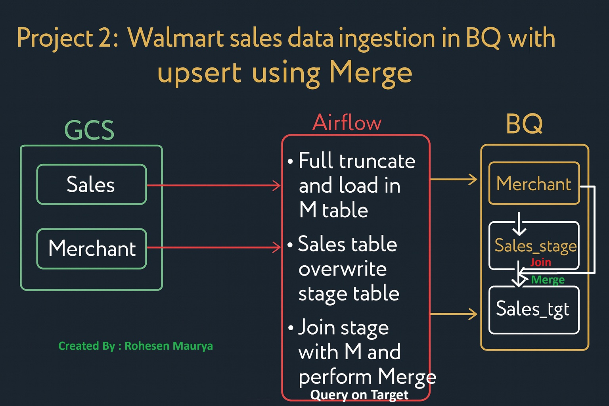
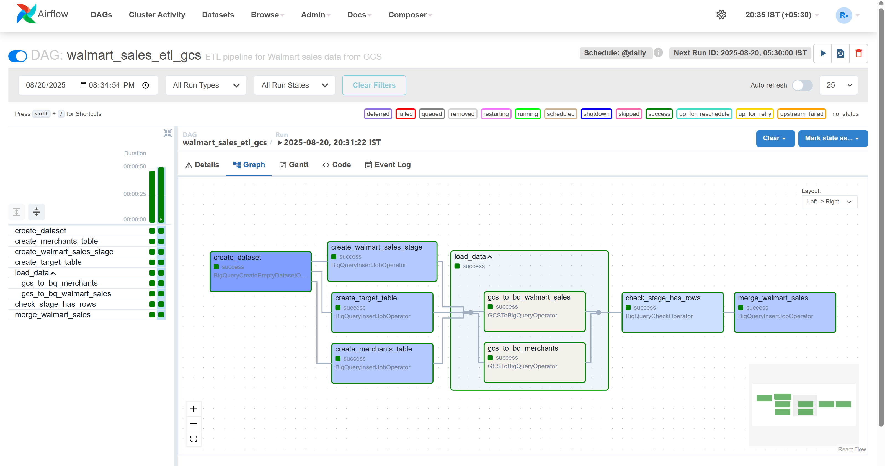
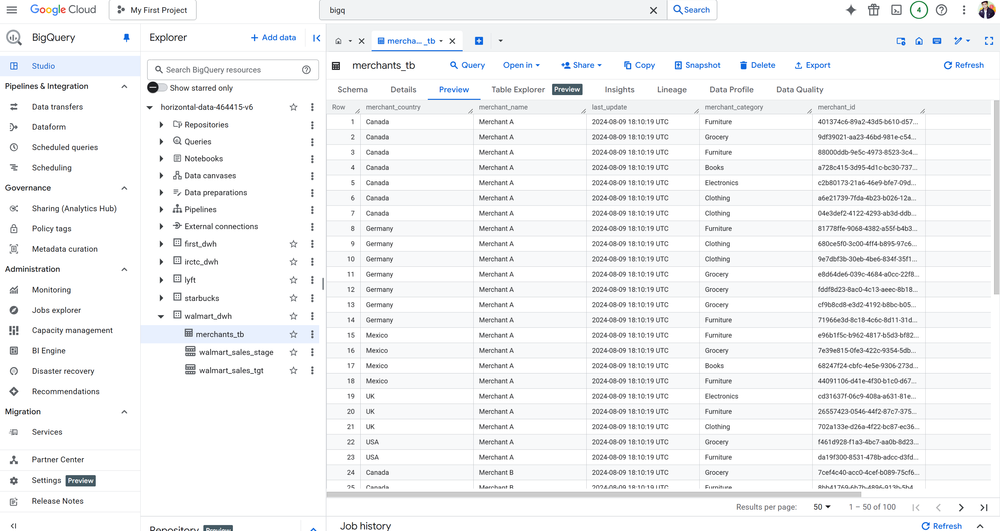
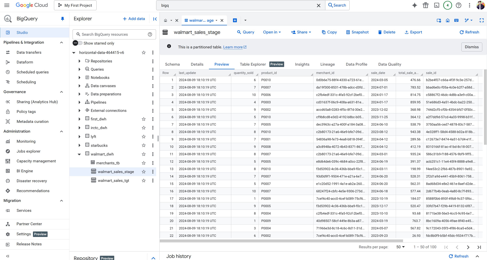
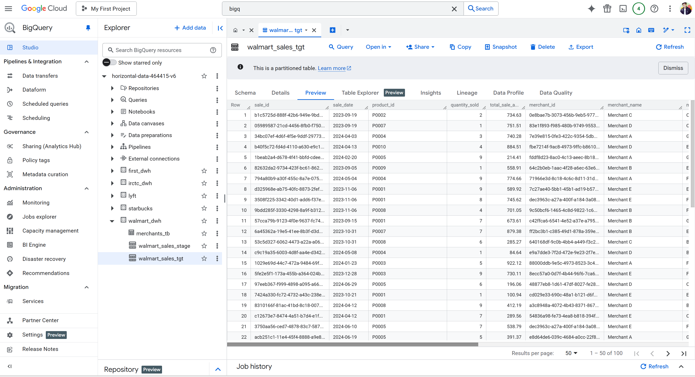
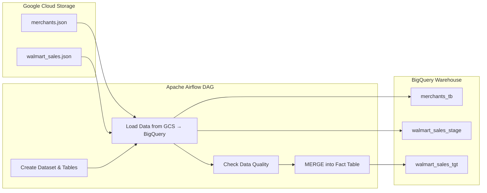
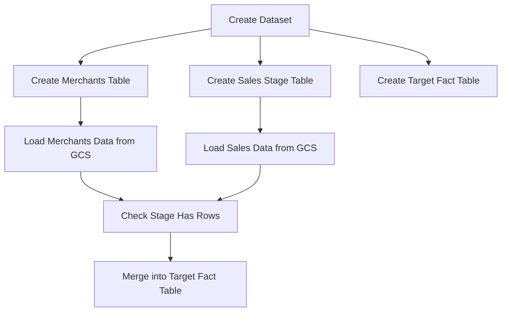

## 📌 Overview
This project demonstrates how to build an **ETL pipeline** using **Airflow** to ingest Walmart data into **Google BigQuery**.  
The pipeline creates required dimension and staging tables, loads data from **Google Cloud Storage (GCS)**, and performs an **upsert** into the fact table using a BigQuery `MERGE` query. 

* **Project Architecture**



* **Airflow Graph**
  
  

* **Merchants Table**
  

* **Walmart Sales Stage Table**


* **Walmart Sales Target Table**


---

## 🛠 Tech Stack
- **Python**
- **Apache Airflow**
- **Google Cloud Storage (GCS)**
- **BigQuery**

---

## 🚀 Pipeline Flow
1. **Create BigQuery Dataset & Tables**  
   - Dimension table: `merchants_tb`  
   - Staging table: `walmart_sales_stage`  
   - Target fact table: `walmart_sales_tgt`

2. **Load Data into Staging**  
   - JSON data from GCS is loaded into the staging and dimension tables using `GCSToBigQueryOperator`.

3. **Upsert into Fact Table**  
   - A `MERGE` query joins staging and dimension tables.  
   - Data is inserted or updated in the target fact table (`walmart_sales_tgt`).

---

## 📂 Project Structure
````
.
├── dags/
│   └── airflow_bigquery_dag.py.py    # Main Airflow DAG
├── data/
│   ├── merchants.json              # Sample merchants JSON
│   └── walmart_sales.json          # Sample sales JSON
└── README.md                       # Project documentation

````

---

## 📥 Sample Data

**merchants.json**
```json
{"merchant_id":"M001","merchant_name":"Acme","merchant_category":"Grocery","merchant_country":"US","last_update":"2025-08-20T10:00:00Z"}
````

**walmart\_sales.json**

```json
{"sale_id":"S1001","sale_date":"2025-08-19","product_id":"P001","quantity_sold":3,"total_sale_amount":59.97,"merchant_id":"M001","last_update":"2025-08-20T10:05:00Z"}
```

Upload to GCS:

```bash
gsutil cp data/merchants.json gs://<your-bucket>/walmart_ingestion/merchants/
gsutil cp data/walmart_sales.json gs://<your-bucket>/walmart_ingestion/sales/
```

---

## 🏗️ Architecture Diagram



---

## ▶️ How to Run

1. Deploy the DAG (`walmart_sales_etl_gcs.py`) to your Airflow `dags/` folder.
2. Update configs in the DAG file:

   ```python
   PROJECT_ID = "your-gcp-project-id"
   DATASET_ID = "walmart_dwh"
   BUCKET = "your-gcs-bucket"
   LOCATION = "US"
   ```
3. Ensure the Airflow/Composer service account has:

   * `roles/storage.objectViewer` on the GCS bucket
   * `roles/bigquery.dataEditor` on the BigQuery dataset
4. Trigger the DAG from Airflow UI:

   ```
   walmart_sales_etl_gcs
   ```

---

## 📈 DAG Flow (Airflow Orchestration)



---

## ✅ Key Features

* Automated **BigQuery table creation** using Airflow operators.
* **Dynamic schema enforcement** for staging and dimension tables.
* **Upsert logic** via BigQuery `MERGE`.
* Modular DAG with clear orchestration.

---

## 🏷️ Tags

`airflow` `bigquery` `gcs` `etl` `walmart` `data-engineering`
